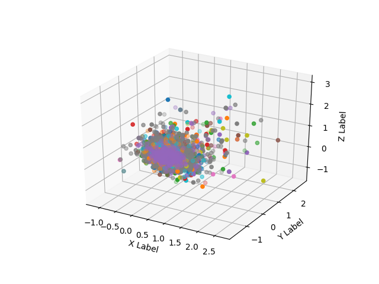
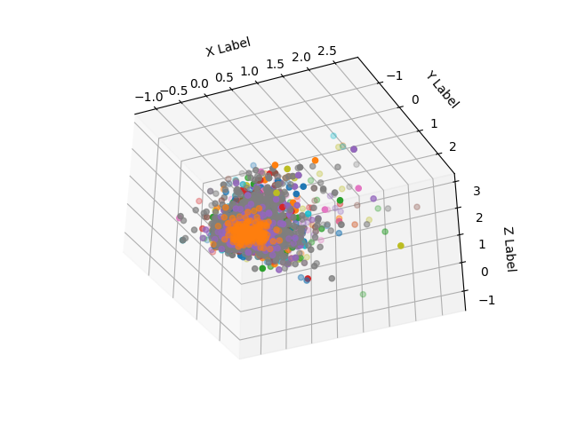
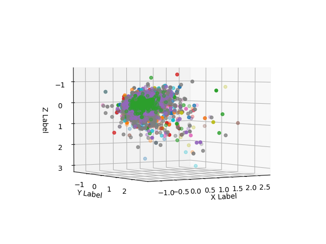
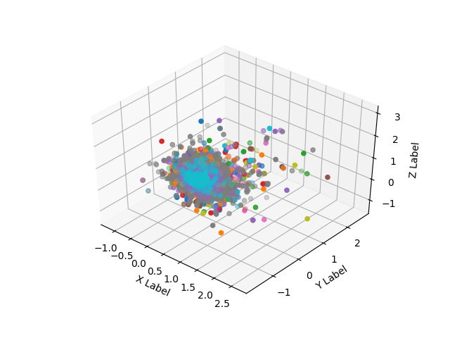

---

Model1

The archiecture

7200-500-250-50-250-500-7200

relu-relu-relu-tanh-relu-relu-relu-linear

+++

Model1

´´´
def encoding_layers(encoding_size):
  return [
    BatchNormalization(),
    Dropout(0.2),
    Dense(500, activation='relu'),

    BatchNormalization(),
    Dropout(0.2),
    Dense(250, activation='relu'),

    BatchNormalization(),
    Dropout(0.2),
    Dense(50, activation='relu'),

    Dense(encoding_size, activation='tanh')
  ]
´´´

+++

Model1

´´´
def decoding_layers(input_size):
  return [
    BatchNormalization(),
    Dropout(0.2),
    Dense(50, activation='relu'),

    BatchNormalization(),
    Dropout(0.2),
    Dense(250, activation='relu'),

    BatchNormalization(),
    Dropout(0.2),
    Dense(500, activation='relu'),

    Dense(input_size, activation='linear')
  ]
´´´

+++

Model1



+++

Model1



+++

Model1



+++

Model1



---

The End :)

---


```
function test() {
  console.log("notice the blank line before this function?");
}
```
